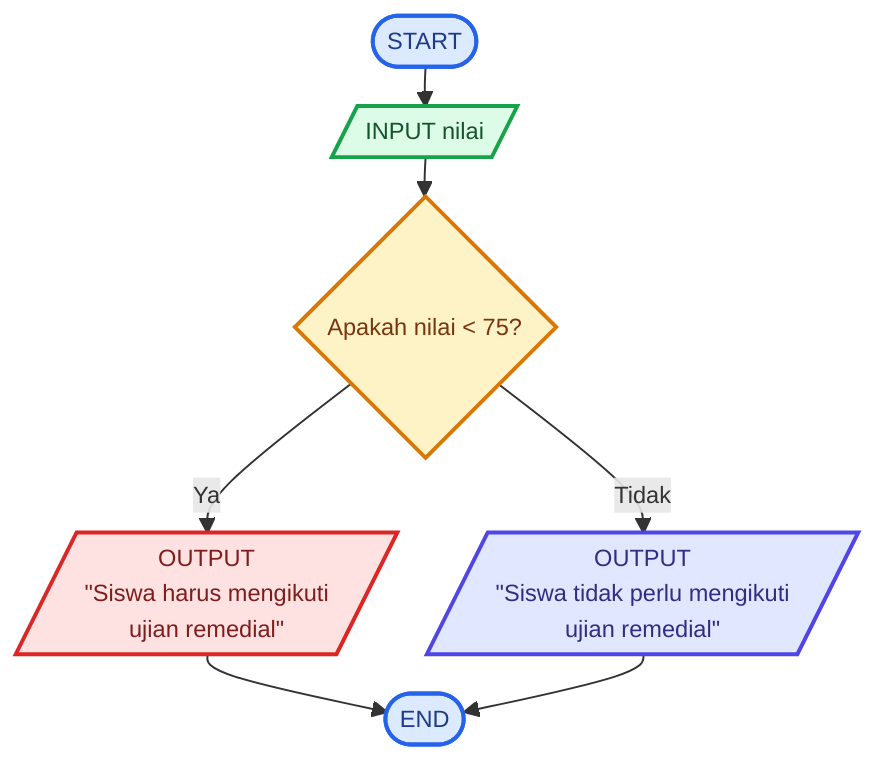

# Kelas-3E-Pemrograman

# 🧮 Logika Matematika - Menghitung Luas dan Keliling Lingkaran

## 📝 **Deskripsi Masalah**
Seorang siswa ingin menghitung luas dan keliling sebuah lingkaran berdasarkan jari-jari yang diketahui. Program akan menerima nilai jari-jari lingkaran sebagai input, kemudian menghitung luas dan keliling lingkaran menggunakan rumus yang telah ditentukan.

Masalah ini dapat digunakan untuk menerapkan operasi matematika dalam sebuah program. Program akan menerima nilai jari-jari lingkaran, kemudian menghitung luas dan keliling berdasarkan nilai tersebut. Hasil perhitungan akan ditampilkan sebagai output.

## 📥 **Input-Proses-Output**
**Input:** Nilai jari-jari lingkaran.

**Proses:** Program menghitung luas dengan rumus `Luas = π × r × r` dan menghitung keliling dengan rumus `Keliling = 2 × π × r`.

**Output:** Nilai luas dan keliling lingkaran.

