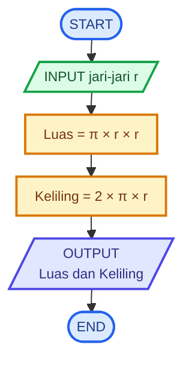

# Kelas-3E-Pemrograman

# 🧮 Logika Matematika - Menghitung Luas dan Keliling Lingkaran

## 📝 **Deskripsi Masalah**
Seorang siswa ingin menghitung luas dan keliling sebuah lingkaran berdasarkan jari-jari yang diketahui. Program akan menerima nilai jari-jari lingkaran sebagai input, kemudian menghitung luas dan keliling lingkaran menggunakan rumus yang telah ditentukan.

Masalah ini dapat digunakan untuk menerapkan operasi matematika dalam sebuah program. Program akan menerima nilai jari-jari lingkaran, kemudian menghitung luas dan keliling berdasarkan nilai tersebut. Hasil perhitungan akan ditampilkan sebagai output.

## 📥 **Input-Proses-Output**
**Input:** Nilai jari-jari lingkaran.

**Proses:** Program menghitung luas dengan rumus `Luas = π × r × r` dan menghitung keliling dengan rumus `Keliling = 2 × π × r`.

**Output:** Nilai luas dan keliling lingkaran.


### 💻 **Pseudocode**

```text
INPUT r

Luas ← π × r × r
Keliling ← 2 × π × r

OUTPUT Luas
OUTPUT Keliling
```

## 📊 **Flowchart**



## 🧪 **Test Case**

| Test Case | Input Jari-jari | Kondisi | Hasil yang Diharapkan |
|---|---:|---|---|
| 1 | 7 cm | r = 7 | Luas = 154 cm², Keliling = 44 cm |
| 2 | 14 cm | r = 14 | Luas = 616 cm², Keliling = 88 cm |

## 🐍 **Implementasi Python**

Implementasi program dibuat menggunakan Python dan dijalankan melalui Visual Studio Code.

Source code dapat dilihat pada **[main.py](main.py)**.

## 📸 **Hasil Pengujian**

Program telah berhasil diuji menggunakan dua nilai jari-jari, yaitu 7 cm dan 14 cm sesuai dengan test case. Hasil perhitungan luas dan keliling sesuai dengan nilai yang telah ditentukan.


